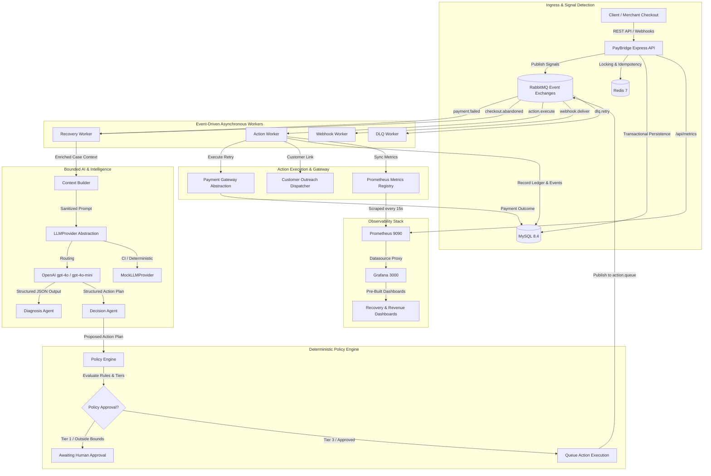

# PayBridge AI

> **Autonomous Payment Revenue Recovery & Checkout Abandonment Agent with Deterministic Policy Safeguards and Real-Time Observability.**

PayBridge AI is an enterprise-grade payment recovery platform that autonomously diagnoses payment failures and checkout abandonments, formulates intelligent recovery strategies via bounded AI agents, enforces strict merchant-defined policy guardrails, and executes multi-channel recovery workflows with zero-variance financial ledger reconciliation.

---

## 1. Problem

Payment failures and checkout abandonments represent significant revenue leakage for digital merchants:

- **Friction-Induced Abandonment:** Shoppers drop off during checkout due to validation errors, payment friction, or session timeouts. Traditional platforms lack automated, context-aware mechanisms to re-engage customers before the transaction intent expires.
- **Gateway & Issuer Declines:** Transient network glitches, issuer throttling, and temporary insufficient balance cause payment declines. Naive blind retries exhaust customer goodwill, violate card network rules, and trigger merchant fee penalties.
- **Opacity & Regulatory Risk:** Black-box automated retries risk overcharging, duplicate charges, and compliance violations. Without strict deterministic policy gates, bounded tool execution, and auditable explainability, merchants cannot safely delegate revenue recovery to autonomous systems.

PayBridge AI solves this by converting lost transactions into structured recovery cases governed by AI diagnosis, deterministic policy bounds, human-in-the-loop escalation, and audit logging.

---

## 2. Solution

PayBridge AI implements a closed-loop autonomous recovery pipeline:

```
Signal Detection (Failure Webhook / Checkout Abandonment)
  │
  ▼
Recovery Case Aggregate (Idempotent Creation / deduplication)
  │
  ▼
Context Enrichment (Failure taxonomy, dwell time, merchant policy, customer history)
  │
  ▼
AI Diagnosis Agent (Extracts root cause, confidence score, recoverability)
  │
  ▼
AI Decision Agent (Formulates recovery strategy & action plan)
  │
  ▼
Deterministic Policy Engine Gate (Validates bounds: amount, cooldown, channel, tier)
  ├── Tier 1 (Conservative) ──► Awaiting Approval (Human-in-the-loop review)
  └── Tier 3 (Autonomous)   ──► Approved & Dispatched
                                   │
                                   ▼
Bounded Action Execution (Smart retry, delayed retry, customer recovery link)
  │
  ▼
Authoritative Ledger Reconciliation & Multi-Channel Observability (Prometheus, Grafana, Audit Export)
```

---

## 3. Key Capabilities

Every capability listed below is implemented and verified in the repository:

- **Payment Failure Ingestion:** Idempotent ingestion of payment failure webhooks and gateway decline signals across card, UPI, and netbanking methods.
- **Checkout Abandonment Telemetry & Ingestion (BT-D1):** Canonical `checkout.abandoned` event schema capturing checkout stages (`method_selected`, `details_entered`, `submit_attempted_failed_validation`, `submit_blocked`), dwell times, and transaction metadata with transactional order history logging.
- **Inactivity Timeout Detection (BT-D2):** Automated background detector evaluating pending checkout sessions against configurable inactivity thresholds (`CHECKOUT_ABANDONMENT_TIMEOUT_SECONDS`, default 900s) with boundary checking and duplicate scan suppression.
- **Autonomous Abandonment Recovery (BT-D3):** End-to-end integration consuming abandonment events, creating linked recovery cases, orchestrating `CUSTOMER_ABANDONED` diagnosis, and generating personalized `CUSTOMER_OUTREACH` recovery links under policy governance.
- **Bounded AI Agents (BT-B1 / BT-E1):** Provider-agnostic `LLMProvider` abstraction supporting production `OpenAIProvider` (`gpt-4o`, `gpt-4o-mini`) and deterministic `MockLLMProvider` with structured Zod schema validation, fail-open circuit breaking, and jittered backoff.
- **Deterministic Policy Engine:** Merchant-configured policy enforcement (`POL-*`) evaluating attempt ceilings, recovery amount limits, cooldown intervals, quiet hours, and autonomy tiers (T1 human-gate vs T3 autonomous).
- **Human-in-the-Loop Approval:** Interactive approval and rejection workflow for restricted recovery plans, surfacing reasoning graphs and policy rules before execution.
- **Distributed Locking & Concurrency Control:** Redis-backed distributed locks with owner tokens and Lua compare-and-delete scripts preventing concurrent double-charges and race conditions.
- **Event-Driven Worker Architecture:** RabbitMQ message topology with dedicated exchanges, queues, retry dead-letter exchanges (DLX), and transactional worker handlers.
- **Durable Payment Idempotency:** Crash-safe MySQL `idempotency_keys` table with SHA-256 payload fingerprinting and deterministic 409 conflict detection.
- **Authoritative Recovery Analytics (BT-C1 / BT-C2):** Read-only recovery analytics engine computing volume KPIs, recovery rates, time-to-recovery (TTR) percentiles (p50, p90, p99), strategy performance, and failure-category distributions with exact 0-variance ledger reconciliation (Invariant **I5**).
- **Prometheus Recovery Metrics (BT-C3):** Low-cardinality Prometheus metrics exposing recovery rates, revenue counters, case status transitions, attempt counters, and TTR latency histograms.
- **Pre-Built Grafana Dashboards (BT-E2):** Production-ready Grafana dashboard templates (`docker/grafana/dashboards/recovery-overview.json`) automatically provisioned via file-based provider configuration.
- **Multi-Pillar Explainability & Zero-PII Defense (BT-C4):** Unified explainability API (`GET /api/recovery/cases/:idOrRef/explainability`) synthesizing case identity, AI diagnosis, decision plan, policy evaluation, and agent traces with recursive deep PII redaction and `assertZeroPII` validation.
- **Dispute & Compliance Audit Trail:** Certified CSV and JSON audit exports with SHA-256 integrity verification hashes.
- **Evaluation Benchmark:** Golden prompt evaluation dataset evaluating model diagnosis accuracy and JSON schema compliance against baseline ground truth.
- **Strict Tenant Isolation:** Multi-tenant repository boundaries filtering all database reads, writes, and cache keys by `merchant_id` (Invariant **I9**).
- **Containerized Infrastructure:** Production-identical Docker Compose configuration orchestrating 12 services including API, workers, databases, message brokers, Prometheus, and Grafana.

---

## 4. Architecture

PayBridge AI enforces strict boundaries between perception, reasoning, governance, and execution. AI agents **never** execute financial mutations or directly interact with database tables; they propose bounded actions evaluated by the deterministic Policy Engine before workers execute side effects.



---

## 5. AI Architecture

The reasoning architecture is designed around deterministic safety, cost control, and auditability:

```
[ Enriched Case Context ]
          │
          ▼
[ PII Redaction Pre-Filter ] (assertZeroPII, masks card numbers, CVVs, emails, names)
          │
          ▼
[ LLMProvider Abstraction ] ──► (MockLLMProvider in CI/tests; OpenAIProvider in production)
          │
          ├── Task: "diagnosis"  ──► gpt-4o-mini (Failure categorization, root cause, confidence)
          └── Task: "decision"   ──► gpt-4o (Action formulation: RETRY_PAYMENT, CUSTOMER_OUTREACH)
          │
          ▼
[ Zod Schema Validator ] ──► Strict JSON Schema enforcement
          │
     ┌────┴────────────────────────┐
   Valid                         Invalid / Outage
     │                             │
     ▼                             ▼
[ Structured Proposal ]      [ Deterministic Rule-Based Fallback ] (AI-004)
     │                             │
     └──────────────┬──────────────┘
                    │
                    ▼
       [ Policy Engine Gate ] (Non-negotiable authoritative arbiter)
```

- **LLMProvider Abstraction:** Domain code interacts exclusively with the `LLMProvider` interface (`server/src/infrastructure/llm/llm.provider.ts`). No vendor SDK imports exist outside the infrastructure module.
- **Provider Implementations:**
  - `OpenAIProvider`: Implements official Node.js SDK (`openai@^7.10.0`) with task-based model routing (`gpt-4o`, `gpt-4o-mini`).
  - `MockLLMProvider`: Deterministic canned responses keyed by input fingerprints for 100% offline, zero-network CI test runs.
- **Resilience Controls:**
  - Hard 20-second invocation timeout.
  - Concurrency limiter capping simultaneous requests.
  - Circuit breaker (`CircuitBreaker`) failing open to deterministic fallback rules (`rules.fallback.ts`) upon consecutive provider errors.
  - Jittered exponential backoff for transient 429/5xx transport errors.
- **Zero-PII Enforcement:** Prompts are scrubbed of customer identifiers, raw card numbers, CVVs, and phone numbers before dispatch. Post-execution outputs are validated using `assertZeroPII`.
- **Traceability & Audit:** Reasoning traces are transactionally recorded in the `agent_traces` table with input prompt hash, completion metadata, model version, token usage, and latency.

---

## 6. Recovery Lifecycle

Recovery cases transition through a 12-state deterministic finite state machine defined in [`server/src/modules/recovery/case.state-machine.ts`](file:///Users/nishant/Documents/PayBridge/server/src/modules/recovery/case.state-machine.ts):

| State | Classification | Description |
|---|---|---|
| `detected` | Non-terminal | Initial ingestion state following a payment failure or checkout abandonment signal. |
| `diagnosing` | Non-terminal | Active AI diagnosis analysis evaluating gateway error codes, customer history, and session dwell times. |
| `scoring` | Non-terminal | Propensity and risk scoring stage evaluating recoverability probability. |
| `deciding` | Non-terminal | Decision agent formulating strategy (`RETRY_PAYMENT`, `DELAYED_RETRY`, `CUSTOMER_OUTREACH`). |
| `awaiting_approval` | Non-terminal | Conservative policy tier (Tier 1) gate requiring explicit human merchant operator sign-off. |
| `executing` | Non-terminal | Action worker actively dispatching gateway retry or customer outreach. |
| `awaiting_outcome` | Non-terminal | Asynchronous wait state pending customer response or webhook outcome. |
| `recovered` | **Terminal** | Authoritative capture succeeded; recovered revenue credited to ledger. |
| `unrecovered` | **Terminal** | All eligible retry/outreach attempts exhausted without successful capture. |
| `suppressed` | **Terminal** | Policy engine vetoed action (e.g. non-addressable hard decline, quiet hours, ceiling reached). |
| `expired` | **Terminal** | Recovery window timed out without resolution. |
| `failed` | **Terminal** | Unhandled system exception or fatal downstream worker processing failure. |

All state transitions commit atomically with an entry in the chronological `case_events` timeline (Invariant **I2**).

---

## 7. Checkout Abandonment Flow (BT-D1 / BT-D2 / BT-D3)

PayBridge AI detects and recovers abandoned checkout sessions without creating parallel recovery pipelines:

1. **Telemetry Ingestion (BT-D1):**
   - The merchant frontend or checkout client dispatches telemetry payloads to `POST /api/payments/orders/:orderRef/abandonment`.
   - Records session dwell time, stage (`method_selected`, `details_entered`, `submit_attempted_failed_validation`, `submit_blocked`), and metadata.
   - Updates `orders.metadata` with abandonment history and publishes `checkout.abandoned` to RabbitMQ.
2. **Inactivity Timeout Detection (BT-D2):**
   - Inactivity detector (`timeout-detector.service.ts`) scans non-terminal checkout orders older than `CHECKOUT_ABANDONMENT_TIMEOUT_SECONDS` (default 900s).
   - Prevents duplicate detection via scan-history state checks and fires `checkout.abandoned` events.
3. **Autonomous Recovery Integration (BT-D3):**
   - Recovery worker consumes `checkout.abandoned` and idempotently creates or links a recovery case in `detected` status.
   - Enriches case with customer checkout history and invokes AI Diagnosis (`CUSTOMER_ABANDONED`).
   - Formulates a recovery decision (`CUSTOMER_OUTREACH` with `send_recovery_link` strategy).
   - Policy Engine evaluates merchant rules (e.g. outreach attempt ceilings, minimum cart value).
   - Dispatches customer communication link while tracking dedicated Prometheus abandonment metrics.

---

## 8. Observability & Metrics

PayBridge AI provides deep runtime observability through structured JSON logging, distributed correlation tracking, and Prometheus/Grafana monitoring:

### Prometheus Metrics
Exported on `GET /metrics` and `GET /api/metrics` via `server/src/infrastructure/metrics.ts`:

- **`recovery_rate`** (Gauge): Authoritative platform recovery success rate (`successfulRecoveries / eligibleCases`).
- **`recovery_revenue_recovered_minor_units_total`** (Counter): Total recovered revenue in integer minor units, labeled by `currency` (e.g. `INR`, `USD`).
- **`recovery_cases_total`** (Counter): Total recovery cases transitioned, labeled by lifecycle `status`.
- **`recovery_attempts_total`** (Counter): Recovery attempts executed across strategies, labeled by `action_type`.
- **`recovery_duration_seconds`** (Histogram): Time to recovery (TTR) from detection to resolution, labeled by `action_type`.
- **`recovery_action_executions_total`** (Counter): Recovery worker action executions, labeled by `action_type` and `status`.
- **`recovery_action_duplicates_suppressed_total`** (Counter): Idempotent duplicate actions suppressed, labeled by `action_type`.
- **`checkout_abandonments_detected_total`** (Counter): Abandonment events detected, labeled by `stage` and `source`.
- **`checkout_abandonment_dwell_time_seconds`** (Histogram): Dwell time distribution of abandoned checkouts, labeled by `stage`.
- **`checkout_abandonment_recoveries_total`** (Counter): Checkout abandonment cases processed, labeled by `stage` and `status`.
- **`http_requests_total`** (Counter): HTTP request throughput, labeled by `method`, `route`, and `status_code`.
- **`http_request_duration_seconds`** (Histogram): API latency SLI, labeled by `method`, `route`, and `status_code`.

### Pre-Built Grafana Dashboard (BT-E2)
Located at `docker/grafana/dashboards/recovery-overview.json` and provisioned automatically via `docker/grafana/dashboards.yml`:

- **Row 1: Autonomous Recovery & Revenue KPIs:** Platform Recovery Rate gauge, Total Recovered Revenue stat, Total Cases, Total Attempts.
- **Row 2: Recovery Pipeline & Action Performance:** Stacked Lifecycle Distribution, Strategy vs Execution performance bars.
- **Row 3: Idempotency Safety & Latency Telemetry:** Duplicate suppression time series, Time to Recovery (TTR) p50 / p90 / p99 quantiles.
- **Row 4: Checkout Abandonment Telemetry:** Abandonments by stage, Abandonment recovery pipeline status, Dwell-time p50 / p90 quantiles.
- **Row 5: API Gateway Health & Ingress SLIs:** HTTP request rate by status code, API P95 latency.

---

## 9. Security, Governance & Design Invariants

The platform enforces five foundational design invariants across all layers:

- **Invariant I2 (Transactional State & Events):** State transitions and timeline audit records commit atomically in a single MySQL transaction.
- **Invariant I4 (Policy Engine Authority):** No financial side-effecting action or outreach dispatch can execute without explicit clearance from the deterministic Policy Engine.
- **Invariant I5 (Strict Minor Units):** All monetary amounts are represented and calculated exclusively as 64-bit integers in minor currency units (paise/cents). Floating-point currency representation is forbidden.
- **Invariant I7 (Zero-PII Leakage):** Customer names, phone numbers, email addresses, and raw card credentials are redacted prior to LLM egress and asserted clean post-execution (`assertZeroPII`).
- **Invariant I9 (Repository Tenant Isolation):** Every database read, update, ledger calculation, and cache key must explicitly scope by `merchant_id`. Cross-tenant data leaks are prevented at the SQL query parameter level.

*Security Notice:* PayBridge AI utilizes modern cryptographic practices, JWT authentication, and secure password hashing. It does not claim formal PCI-DSS or SOC 2 compliance certifications.

---

## 10. API Specification

The platform exposes RESTful endpoints documented in the canonical OpenAPI 3.0 specification ([`docs/openapi.yaml`](file:///Users/nishant/Documents/PayBridge/docs/openapi.yaml)):

### Core Endpoint Groups
- **Authentication:** `POST /api/auth/register`, `POST /api/auth/login`, `POST /api/auth/refresh`
- **Payments & Checkout:**
  - `POST /api/payments/orders`: Idempotent order creation
  - `POST /api/payments/orders/:orderRef/pay`: Process payment attempt
  - `GET /api/payments/orders/:orderRef/status`: Query payment status
  - `POST /api/payments/orders/:orderRef/abandonment`: Ingest checkout abandonment signal (BT-D1)
  - `POST /api/payments/checkout/timeout-detection`: Trigger batch inactivity timeout scan (BT-D2)
- **Recovery Operations:**
  - `GET /api/recovery/cases`: List tenant recovery cases with pagination and status filters
  - `GET /api/recovery/cases/:idOrRef`: Fetch recovery case aggregate detail
  - `GET /api/recovery/cases/:idOrRef/timeline`: Fetch chronological case event timeline
  - `GET /api/recovery/cases/:idOrRef/traces`: Fetch sanitized AI agent reasoning traces
  - `GET /api/recovery/cases/:idOrRef/explainability`: Multi-pillar explainability payload (BT-C4)
  - `POST /api/recovery/cases/:idOrRef/approve`: Operator approval for Tier 1 cases
  - `POST /api/recovery/cases/:idOrRef/reject`: Operator rejection for Tier 1 cases
- **Analytics & Reporting:**
  - `GET /api/recovery/analytics`: Tenant-scoped recovery performance KPIs and TTR percentiles (BT-C2)
  - `GET /api/merchants/recovery/ledger`: Authoritative zero-variance recoverable revenue ledger
  - `GET /api/merchants/audit/export`: Certified dispute and audit export (CSV / JSON)
- **Observability:**
  - `GET /health`: Process health check
  - `GET /metrics` & `GET /api/metrics`: Prometheus scrape endpoints

---

## 11. Local Development & Setup

### Prerequisites
- Node.js `>= 20.0.0`
- npm `>= 10.0.0`
- Docker & Docker Compose (for containerized infrastructure)

### 1. Clone & Configure Environment
```bash
git clone https://github.com/nishantkr0904/paybridge-payment-integration-platform.git
cd paybridge-payment-integration-platform

# Copy environment template
cp .env.example .env
```

### 2. Install Dependencies
```bash
npm install
```

### 3. Start Supporting Infrastructure (Docker)
```bash
# Launch MySQL, Redis, RabbitMQ, Prometheus, and Grafana
docker compose up -d mysql redis rabbitmq prometheus grafana
```

### 4. Run Database Migrations
```bash
npm run db:migrate
```

### 5. Start Development Servers
```bash
# Start backend API (Port 4000)
npm run dev:server

# Start frontend application (Port 5173)
npm run dev:client

# Start background workers (in separate terminal sessions)
npm run dev:payment-worker --workspace server
npm run dev:recovery-worker --workspace server
npm run dev:action-worker --workspace server
npm run dev:webhook-worker --workspace server
npm run dev:dlq-worker --workspace server
```

---

## 12. Dockerized Production Stack

The repository includes a complete `docker-compose.yml` defining 12 containerized services:

| Service | Image / Build | Port | Purpose |
|---|---|---|---|
| `paybridge-api` | `docker/server.Dockerfile` | `4000:4000` | Express REST API & Metrics Ingress |
| `paybridge-client` | `docker/client.Dockerfile` | `5173:80` | React / Vite Dashboard Cockpit |
| `paybridge-payment-worker` | `docker/server.Dockerfile` | — | Payment failure & charge processing worker |
| `paybridge-recovery-worker` | `docker/server.Dockerfile` | — | Recovery case orchestration & AI diagnosis worker |
| `paybridge-action-worker` | `docker/server.Dockerfile` | — | Bounded recovery action dispatcher |
| `paybridge-webhook-worker` | `docker/server.Dockerfile` | — | Merchant webhook event delivery worker |
| `paybridge-dlq-worker` | `docker/server.Dockerfile` | — | Dead letter queue triage and replay worker |
| `mysql` | `mysql:8.4` | `3306:3306` | Primary relational store (Tables, Ledger, Events) |
| `redis` | `redis:7-alpine` | `6379:6379` | Distributed locks & token replay caching |
| `rabbitmq` | `rabbitmq:3-management-alpine` | `5672:5672`, `15672:15672` | Event exchange and reliable task queueing |
| `prometheus` | `prom/prometheus:latest` | `9090:9090` | Time-series metrics collection & scraping |
| `grafana` | `grafana/grafana:latest` | `3000:3000` | Pre-provisioned recovery & revenue observability dashboards |

To start the full platform:
```bash
docker compose up -d
```
- Web Application: `http://localhost:5173`
- API & Metrics: `http://localhost:4000/api/metrics`
- RabbitMQ Management: `http://localhost:15672` (guest / guest)
- Prometheus UI: `http://localhost:9090`
- Grafana Cockpit: `http://localhost:3000` (admin / admin)

---

## 13. Testing & Verification

PayBridge maintains comprehensive automated test coverage with strict regression barriers:

```bash
# Run full server test suite
npm run test --workspace server

# Run client test suite
npm run test --workspace client

# Run production build checks
npm run build

# Run linting
npm run lint
```

### Verified Test Suite Counts
- **Server Suite:** **489 tests passing**, 1 skipped (36 test suites covering infrastructure, modules, state machine, workers, AI agents, analytics, and Grafana verification).
- **Client Suite:** **12 tests passing** (React cockpit rendering, navigation, and state interactions).
- **Total Automated Tests:** **501 tests passing** across the repository.
- **Build Status:** 0 TypeScript compiler errors (`tsc -p tsconfig.json`), 0 Vite production build errors.
- **Lint Status:** 0 ESLint errors, 0 warnings across all workspaces.

---

## 14. Buildathon Demonstration Harness (BT-E1)

The platform includes a dedicated, reproducible CLI demonstration harness:

```bash
# Run demonstration in deterministic mode (MockLLMProvider, 100% offline, zero network calls)
npm run demo:llm

# Run demonstration with explicit deterministic flag
npm run demo:llm -- --deterministic

# Run demonstration using live OpenAI provider (requires OPENAI_API_KEY)
npm run demo:llm -- --mode=openai

# Demonstrate Tier 1 human-approval gate vs Tier 3 autonomous policy gate
npm run demo:llm -- --tier=T1
npm run demo:llm -- --tier=T3
```

The demonstration harness executes the full end-to-end recovery pipeline:
1. Ingests checkout abandonment signal with dwell-time telemetry.
2. Creates and transitions recovery case aggregate into `detected`.
3. Invokes AI Diagnosis to extract root cause (`CUSTOMER_ABANDONED`).
4. Invokes AI Decision Agent to propose personalized recovery link strategy.
5. Evaluates proposal against Policy Engine rules.
6. Renders structured 5-pillar audit report with zero PII leaks.

*Note on Live Mode:* If `--mode=openai` is selected without `OPENAI_API_KEY` configured in the environment, the CLI gracefully refuses live execution, displays setup instructions, and avoids leaking credentials.

---

## 15. Technology Stack

- **Runtime & Language:** Node.js `>= 20.0.0`, TypeScript 5.7
- **Backend Framework:** Express 4.21 with Helmet security headers and CORS
- **Frontend Dashboard:** React 18, Vite 6, Tailwind CSS, Lucide React
- **Relational Store:** MySQL 8.4 with transactional SQL migrations
- **Distributed Cache & Locking:** Redis 7 with Lua scripting
- **Message Broker:** RabbitMQ 3 (AMQP 0-9-1) with dead-letter exchange routing
- **AI & Reasoning:** Official OpenAI Node.js SDK (`openai@^7.10.0`), Zod structured schema validation
- **Observability Stack:** `prom-client` 15, Prometheus 2, Grafana 10
- **Testing & Verification:** Vitest 4, ESLint 9

---

## 16. Repository Structure

```
paybridge/
├── client/                     # React / Vite frontend application
│   ├── src/
│   │   ├── components/         # Reusable UI components
│   │   ├── pages/              # RecoveryPage, OrderDetailPage, DashboardPage, etc.
│   │   └── services/           # Frontend API client
├── database/                   # Database migrations (001_auth to 006_agent_trace)
├── docker/                     # Docker configurations & provisioning
│   ├── client.Dockerfile       # Multi-stage client build
│   ├── server.Dockerfile       # Multi-stage server build
│   ├── prometheus/             # Prometheus scraper configuration
│   └── grafana/                # Grafana datasource and dashboard provisioning
│       ├── datasources.yml     # Prometheus datasource definition
│       ├── dashboards.yml      # Dashboard provider configuration
│       └── dashboards/         # Pre-built JSON dashboard templates
├── docs/                       # Project documentation & OpenAPI spec
│   ├── openapi.yaml            # Canonical OpenAPI 3.0 contract
│   └── PAYBRIDGE_ARCHITECTURE.md
├── server/                     # Express backend & worker services
│   ├── src/
│   │   ├── config/             # Environment configuration validation
│   │   ├── database/           # MySQL pool and migration runner
│   │   ├── demo/               # E1 CLI demonstration harness (cli.ts, real-llm-demo.ts)
│   │   ├── infrastructure/     # Redis, RabbitMQ, Prometheus metrics, and LLM providers
│   │   ├── middleware/         # Auth, correlation ID, and metrics middlewares
│   │   ├── modules/            # Domain modules (recovery, ai, policy, payment, etc.)
│   │   ├── workers/            # Asynchronous background workers (payment, recovery, action, etc.)
│   │   └── __tests__/          # Vitest automated test suites (36 test files)
├── docker-compose.yml          # 12-service production container orchestration
├── package.json                # Root workspaces package configuration
└── LICENSE                     # MIT License
```

---

## 17. Project Status & Roadmap

PayBridge AI has completed core buildathon milestones:
- [x] **Phase 0–6:** Foundation, Payments, Idempotency, Policies, Workers, Recovery Cockpit
- [x] **BT-A1:** Worker Deployment Completeness
- [x] **BT-B1:** Real LLM Provider SDK Integration (OpenAI)
- [x] **BT-C1–C3:** Recovery Analytics Engine, API & Prometheus Metrics
- [x] **BT-C4:** Multi-Pillar Explainability Payload API
- [x] **BT-D1–D3:** Checkout Abandonment Detection, Inactivity Timeout & Autonomous Pipeline Integration
- [x] **BT-E1:** Reproducible Real LLM Demonstration Harness
- [x] **BT-E2:** Pre-Built Grafana Recovery & Revenue Dashboards
- [x] **BT-A3:** Comprehensive Evidence-Based Project Documentation
- [ ] **BT-E3:** Final Buildathon Regression Suite & Certification

---

## 18. License

This project is licensed under the [MIT License](LICENSE).
Copyright (c) 2026 Nishant Kumar.
