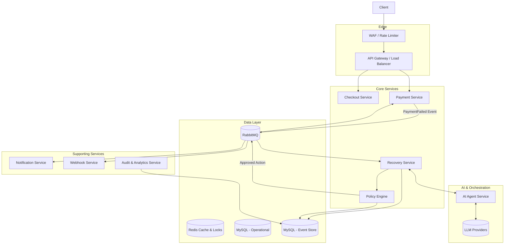
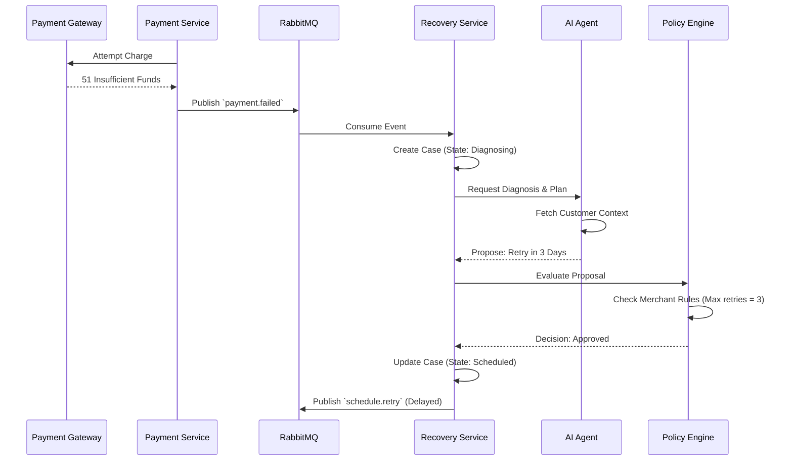

# PayBridge AI — Architecture Specification

## 1. Architecture Overview

### System Purpose
PayBridge AI transforms a traditional, reactive payment gateway integration into an autonomous, proactive revenue recovery platform. The system shifts the burden of handling failed payments, abandoned checkouts, and customer outreach from manual operator effort to an intelligent, bounded AI orchestration engine.

### Architecture Goals
1. **Absolute Reliability:** Money movement must never be compromised or duplicated.
2. **Explainability:** Every autonomous decision must be transparent, auditable, and easily understood by a human operator.
3. **Bounded Autonomy:** The AI proposes, but deterministic, hard-coded rules dispose. AI cannot violate merchant constraints or platform rate limits.
4. **Strict Tenant Isolation:** Data from one merchant must never influence or leak to another.

### Design Philosophy
The architecture treats AI as a **non-deterministic, highly capable component surrounded by deterministic safeguards**. LLMs are utilized for their reasoning, classification, and language generation capabilities, but their outputs are treated as untrusted inputs to a strict Policy Engine. All state changes flow through an immutable Event Store to ensure regulatory compliance and forensic capability.

### Guiding Engineering Decisions
- **No Synchronous AI in the Critical Path:** The checkout API (`POST /payments/orders`) must respond in <200ms. AI diagnosis and recovery planning happen asynchronously via background workers.
- **Fail Closed:** If the AI is down, rate-limited, or produces malformed output, the system defaults to a safe state (e.g., standard static retry schedule or manual human review).
- **Event-Driven Workflows:** Business processes are choreographed through RabbitMQ, ensuring durability and retryability.

---

## 2. Current Architecture

### Current Implementation & Services
The existing PayBridge implementation is a modular monolith written in Node.js (TypeScript) with an Express API and a Vite/React SPA. The backend is conceptually segmented into `auth`, `payment`, `webhook`, and `merchant` modules. 

The system runs as four distinct processes sharing a single codebase:
1. `paybridge-api`: Serves HTTP REST traffic.
2. `paybridge-payment-worker`: Consumes from `payment_processing_queue` to simulate gateway interactions.
3. `paybridge-webhook-worker`: Consumes from `webhook_delivery_queue` for outbound HTTP calls.
4. `paybridge-dlq-worker`: Consumes dead letters.

### Communication & Database
- **Tight Coupling:** Workers directly import repository layers instead of communicating via APIs or gRPC.
- **Database:** MySQL 8.4 is the sole persistence layer, managed by raw SQL scripts without a migration tool. Tenant isolation is enforced inconsistently in the service layer (a violation of invariant I9).
- **Queues:** RabbitMQ uses direct exchanges with persistent messages and a basic DLQ topology.
- **Caching & Locks:** Redis 7 is present but used *only* for unsafe, non-atomic distributed locks; no actual caching exists.

### Technical Debt & Gaps
The current architecture lacks idempotency keys, safe distributed locking, graceful shutdown, automated testing, and comprehensive observability (trace IDs are absent). These must be remediated as a prerequisite for the AI transformation.

---

## 3. Target Architecture

### Future Architecture
The target architecture pivots to an **Event-Driven Microservices pattern** centered around a **Case State Machine** and a **Policy Engine**.

### Component Interactions & Recovery Orchestration
When a payment fails, the Payment Service emits a `PaymentFailed` event. The new Recovery Service creates a "Case". The orchestration follows a strict pipeline:
1. **Signal Ingestion:** Gather transaction context.
2. **AI Diagnosis:** The AI Agent Service analyzes the failure and proposes a recovery playbook (e.g., "Retry on Payday" vs "Send Email Outreach").
3. **Policy Evaluation:** The deterministic Policy Engine evaluates the AI's proposal against merchant constraints (e.g., "Max 3 retries", "No emails on weekends").
4. **Execution:** Action Handlers perform the approved tasks (schedule retry, dispatch notification).

### Bounded Autonomy
The AI operates within a sandbox. If the AI proposes an action that violates the autonomy tier, the Policy Engine overrides it, rejecting the action or flagging it for human operator review in the Recovery Cockpit.

---

## 4. High-Level System Architecture

---

## 5. Component Architecture

### API Gateway
- **Purpose:** Central ingress point for all client and merchant API traffic.
- **Responsibilities:** JWT verification, IP rate limiting, idempotency key extraction, correlation ID injection, payload sanitization.
- **Failure Modes:** If down, no synchronous API traffic flows. Highly available via horizontal scaling.

### Payment Service
- **Purpose:** Core ledger and transaction processing.
- **Responsibilities:** Interface with external payment gateways, manage transaction state, enforce synchronous validation.
- **Dependencies:** Operational MySQL, Redis (Locks).

### Recovery Service (New)
- **Purpose:** Orchestrate the lifecycle of a failed transaction.
- **Responsibilities:** Maintain the Case State Machine, schedule actions, trigger diagnosis, handle operator overrides.

### AI Agent Service (New)
- **Purpose:** Encapsulate all non-deterministic LLM interactions.
- **Responsibilities:** Prompt assembly, context injection, LangGraph workflow orchestration, tool execution, parsing outputs.
- **Security Concerns:** Prompt injection, PII leakage. Payloads must be strictly scrubbed before transmission to external LLMs.

### Policy Engine (New)
- **Purpose:** The deterministic safeguard.
- **Responsibilities:** Evaluate proposed actions against merchant configurations, autonomy tiers, and platform-wide kill switches.
- **Dependencies:** Reads from Redis/MySQL for fast configuration lookups.

### Audit Service (New)
- **Purpose:** Maintain the immutable system of record.
- **Responsibilities:** Write all state changes, policy decisions, and operator actions to the append-only Event Store.

### Dashboard (Recovery Cockpit)
- **Purpose:** Operator interface for triage and manual intervention.
- **Dependencies:** Reads primarily from materialized views / Read Models managed by the Analytics Service to prevent operational DB load.

---

## 6. AI Architecture

### Agent Orchestration via LangGraph
The AI Agent Service uses a state-machine-like workflow (e.g., LangGraph) to bound LLM reasoning into discrete, observable steps.
1. **Diagnosis Agent:** Analyzes raw gateway error codes, past customer history, and velocity to determine the root cause (e.g., "Temporary Insufficient Funds" vs "Hard Card Block").
2. **Decision Agent (Recovery Planner):** Given the diagnosis, selects a playbook and proposes specific parameters (e.g., "Schedule retry for Friday at 9am").
3. **Risk Agent:** Scores the probability of recovery (Propensity Score) to rank the triage queue.

### Prompt Management & Context Builder
Prompts are versioned and stored in the database, treated as configuration. The Context Builder fetches historical transactions for the customer, masks PII, and builds a strict JSON context object injected into the system prompt.

### Tool Calling & Bounded Execution
Agents interact with the system strictly via predefined Tools (e.g., `get_merchant_rules()`, `calculate_optimal_time()`). The LLM does not execute code or query databases directly. Total token usage and execution timeouts (e.g., 15s max) are strictly enforced.

### LLM Failover & Abstraction
The system implements a provider abstraction layer. If the primary provider (e.g., OpenAI) returns 5xx errors or rate limits, the request seamlessly fails over to a secondary provider (e.g., Anthropic) using a semantically equivalent prompt mapping.

---

## 7. Event-Driven Architecture

### RabbitMQ Topology
- **Exchanges:** 
  - `domain.events` (Topic Exchange) - For broadcasting state changes (`order.created`, `payment.failed`, `case.resolved`).
  - `domain.commands` (Direct Exchange) - For targeted work (`process.payment`, `deliver.webhook`, `execute.playbook`).
- **Queues:** Dedicated queues per consumer group with prefetch limits tuned to expected IO latency.
- **Dead-Letter Queues (DLQ):** Every work queue configures an `x-dead-letter-exchange`. Unprocessable messages (e.g., parsing failures, max retries exceeded) route to the DLQ for operator inspection.
- **Delay Queues:** Utilizes RabbitMQ Delayed Message Plugin (or TTL queues) for scheduling retries hours or days in advance.

### Idempotency & Tracing
- **Correlation IDs:** Generated at the edge (`X-Request-Id`) and carried in the `headers` of every RabbitMQ message envelope, ensuring distributed tracing across all components.
- **Idempotency:** The API checks an `Idempotency-Key` header against Redis (`SETNX`). Message consumers enforce idempotency via database unique constraints or state machine transition checks.

---

## 8. Recovery Workflow

---

## 9. Database Architecture

### Separation of Concerns
1. **Operational Store (MySQL):** 3rd Normal Form schema for core entities (Merchants, Orders, Transactions, Cases). Optimized for ACID transactions and state transitions.
2. **Event Store (MySQL / Append-Only):** A dedicated schema where the application role only has `INSERT` and `SELECT` privileges. Stores immutable records of every action, policy decision, and manual override.
3. **Redis:** Used exclusively for ephemeral data: caching (merchant configurations, API responses), rate limit counters, idempotency keys, and safe atomic distributed locks (via Lua scripts).

### Tenant Isolation
Isolation is enforced at the repository layer. Every operational query must inherently require `tenant_id` as an argument, making accidental cross-tenant leaks structurally impossible at compile time.

---

## 10. API Architecture

### Design Standards
- **RESTful:** Strict resource-oriented URLs (e.g., `POST /api/v1/payments/{id}/retry`).
- **Versioning:** URL-based versioning (`/v1/`) to allow safe deprecation of endpoints.
- **Pagination:** Cursor-based pagination (`?cursor=XYZ&limit=20`) to guarantee stable results under concurrent writes, replacing unstable OFFSET pagination.

### Authentication & Error Handling
- **JWT Auth:** Stateless session management for operators.
- **API Keys:** For merchant integrations, hashed securely (bcrypt/argon2) in the database.
- **Standardized Errors:** All errors return an RFC 7807 Problem Details JSON format, ensuring consumers can parse error codes consistently.

---

## 11. Security Architecture

### Data Governance & PII Isolation
- **Redaction Middleware:** Before any payload is logged or sent to the AI Agent Service, a sanitization utility strips defined PII fields (email, phone, address).
- **Least Privilege:** Database users are segregated. The API user cannot drop tables; the Event Store user cannot update or delete rows.
- **Prompt Injection Protection:** User-generated inputs (e.g., customer email responses) are strictly isolated within delimiters in LLM prompts, and output is structurally validated (JSON schema) before taking action.

---

## 12. Observability Architecture

### Instrumentation
- **Structured Logging:** Pino generates JSON logs. Every log line includes `req.id` and `merchant.id`.
- **Metrics:** Prometheus scrapes `/metrics` endpoints. Custom SLIs track "Time-to-Recovery", "Policy Veto Rate", and "Agent Latency".
- **Dashboards:** Grafana visualizes the operational health, SLA breaches, and RabbitMQ queue depths.

---

## 13. Deployment Architecture

### Current to Future State
- **Current:** Docker Compose.
- **Target:** Kubernetes (EKS/GKE).
- **CI/CD:** GitHub Actions executes automated tests, builds immutable Docker images tagged with Git SHA, and deploys via a GitOps model (e.g., ArgoCD).
- **Configuration:** Runtime configurations and secrets are injected via Kubernetes Secrets / HashiCorp Vault, replacing static `.env` files.

---

## 14. Scalability Strategy

- **Horizontal Worker Scaling:** RabbitMQ enables trivial scaling of consumers. If the `payment_processing_queue` backs up, HPA (Horizontal Pod Autoscaler) spins up more worker pods.
- **AI Scaling:** LLM provider rate limits are the primary bottleneck. The system utilizes exponential backoff for provider 429s and routes across multiple API keys or providers to maximize throughput.
- **Database:** Read-heavy operations (e.g., Dashboard triage queue) query read-replicas or materialized views to protect the primary writer node.

---

## 15. Reliability Architecture

- **Circuit Breakers:** External HTTP calls (Webhooks, LLM APIs, Payment Gateways) are wrapped in Circuit Breakers to prevent cascading failures.
- **Timeouts:** Hard timeouts on all synchronous operations.
- **Graceful Degradation:** If the AI Agent Service is offline, the system degrades to static, rule-based retries. If the UI cannot fetch analytics, core payment routing remains unaffected.
- **Graceful Shutdown:** `SIGTERM` signals drain active HTTP requests and `nack` unacknowledged RabbitMQ messages before container termination.

---

## 16. Technology Decisions

| Technology | Purpose | Justification & Alternatives |
|---|---|---|
| **Node.js (TypeScript)** | Core Application | Excellent async I/O. Strict typing prevents runtime errors. Alternative: Go (faster, but team lacks expertise). |
| **MySQL 8.4** | Relational Data | ACID compliance, proven reliability. Alternative: PostgreSQL (comparable, MySQL chosen for existing baseline). |
| **RabbitMQ** | Message Broker | Advanced routing, native DLQs, delay plugins. Better suited for complex workflows than Kafka (which favors stream processing). |
| **Redis** | Caching & Locks | Industry standard for high-performance ephemeral state and atomic operations. |
| **LangGraph** | AI Orchestration | Provides cyclic, stateful workflows essential for bounded agentic reasoning. Alternative: AutoGen, raw API calls. |

---

## 17. Architecture Decision Records

- **ADR-001: Why RabbitMQ?** Chosen over Kafka due to the need for complex routing keys, individual message acknowledgment, and native dead-lettering for failed tasks.
- **ADR-002: Why Separate the Policy Engine from AI?** To ensure deterministic safety. LLMs hallucinate; hardcoded rules do not. Separating them guarantees the system fails closed.
- **ADR-003: Why an Append-Only Event Store?** Required for financial auditing. In-place updates destroy history, making it impossible to answer "Why did the system do this yesterday?".

---

## 18. Future Evolution

- **Multi-Region Active-Active:** Deploying across two distinct cloud regions for disaster recovery.
- **Model Routing Layer:** Implementing an intelligent router (e.g., LiteLLM) to dynamically route AI requests to smaller, cheaper models (Llama 3) for simple tasks, and advanced models (Claude 3.5 Sonnet / GPT-4o) for complex reasoning.
- **Canary Deployments:** Shifting 5% of traffic to new worker versions to validate logic safely before full rollout.
