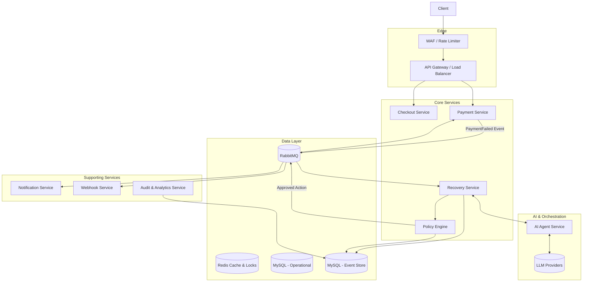
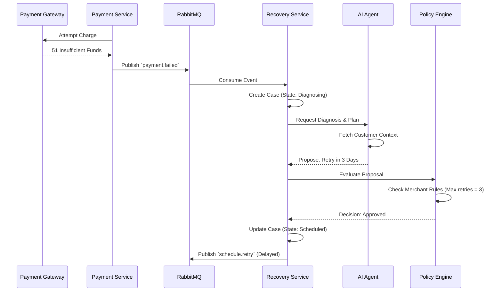

# PayBridge AI — Architecture Specification

## 1. Architecture Overview

### System Purpose
PayBridge AI transforms a traditional, reactive payment gateway integration into an autonomous, proactive revenue recovery platform. The system shifts the burden of handling failed payments, abandoned checkouts, and customer outreach from manual operator effort to an intelligent, bounded AI orchestration engine.

### Architecture Goals
1. **Absolute Reliability:** Money movement must never be compromised or duplicated.
2. **Explainability:** Every autonomous decision must be transparent, auditable, and easily understood by a human operator.
3. **Bounded Autonomy:** The AI proposes, but deterministic, hard-coded rules dispose. AI cannot violate merchant constraints or platform rate limits.
4. **Strict Tenant Isolation:** Data from one merchant must never influence or leak to another.

### Design Philosophy
The architecture treats AI as a **non-deterministic, highly capable component surrounded by deterministic safeguards**. LLMs are utilized for their reasoning, classification, and language generation capabilities, but their outputs are treated as untrusted inputs to a strict Policy Engine. All state changes flow through an immutable Event Store to ensure regulatory compliance and forensic capability.

### Guiding Engineering Decisions
- **No Synchronous AI in the Critical Path:** The checkout API (`POST /payments/orders`) must respond in <200ms. AI diagnosis and recovery planning happen asynchronously via background workers.
- **Fail Closed:** If the AI is down, rate-limited, or produces malformed output, the system defaults to a safe state (e.g., standard static retry schedule or manual human review).
- **Event-Driven Workflows:** Business processes are choreographed through RabbitMQ, ensuring durability and retryability.

---

## 2. Current Architecture

### Current Implementation & Services
The existing PayBridge implementation is a modular monolith written in Node.js (TypeScript) with an Express API and a Vite/React SPA. The backend is conceptually segmented into `auth`, `payment`, `webhook`, and `merchant` modules. 

The system runs as four distinct processes sharing a single codebase:
1. `paybridge-api`: Serves HTTP REST traffic.
2. `paybridge-payment-worker`: Consumes from `payment_processing_queue` to simulate gateway interactions.
3. `paybridge-webhook-worker`: Consumes from `webhook_delivery_queue` for outbound HTTP calls.
4. `paybridge-dlq-worker`: Consumes dead letters.

### Communication & Database
- **Tight Coupling:** Workers directly import repository layers instead of communicating via APIs or gRPC.
- **Database:** MySQL 8.4 is the sole persistence layer, storing operational entities (`merchants`, `orders`, `transactions`, `idempotency_keys`, `webhook_endpoints`, `webhook_deliveries`).
- **Queues:** RabbitMQ uses direct exchanges with persistent messages, worker `prefetch(1)`, and a dead-letter exchange (DLX) routing to `payment_dlq`.
- **Caching & Locks:** Redis 7 provides safe atomic distributed locks using unique UUID owner tokens and Lua compare-and-delete release scripts (`lock:order:${orderRef}`, `lock:worker:txn:${transactionId}`).

### Technical Debt Remediated & Remaining Gaps
- **Remediated in Phase 0 & Phase 1:** Safe distributed locking (Lua CAS release, D2 fixed), durable MySQL-backed request idempotency (`idempotency_keys` table with SHA-256 fingerprinting), hardened payment worker duplicate-delivery guards, phased graceful shutdown with in-flight work draining (`server/src/utils/shutdown.ts`), correlation ID propagation across HTTP → RabbitMQ → workers (`server/src/middleware/correlation-id.ts`), custom Prometheus HTTP RED metrics with cardinality protection (`server/src/infrastructure/metrics.ts`, `server/src/middleware/metrics.ts`), Prometheus Compose scraper fix (Defect D1, `docker/prometheus/prometheus.yml`), versioned database migration engine (`TASK-101` / `FND-005` in `server/src/infrastructure/migrator.ts` and `server/src/database/cli.ts` with `schema_migrations` and advisory locking), recovery domain & event store schemas (`TASK-102` / `RCV-001` / `AUD-001` in `database/migrations/005_recovery_schema.up.sql` covering `cases`, `case_events`, `policies`, and `audit_logs`), and comprehensive automated test suites (107 tests across 10 test files in Vitest).
- **Remaining Gaps:** Rate limiting (Tier 1 WAF/Redis token bucket). These are scheduled in upcoming roadmap milestones.

---

## 3. Target Architecture

### Future Architecture
The target architecture pivots to an **Event-Driven Microservices pattern** centered around a **Case State Machine** and a **Policy Engine**.

### Component Interactions & Recovery Orchestration
When a payment fails, the Payment Service emits a `PaymentFailed` event. The new Recovery Service creates a "Case". The orchestration follows a strict pipeline:
1. **Signal Ingestion:** Gather transaction context.
2. **AI Diagnosis:** The AI Agent Service analyzes the failure and proposes a recovery playbook (e.g., "Retry on Payday" vs "Send Email Outreach").
3. **Policy Evaluation:** The deterministic Policy Engine evaluates the AI's proposal against merchant constraints (e.g., "Max 3 retries", "No emails on weekends").
4. **Execution:** Action Handlers perform the approved tasks (schedule retry, dispatch notification).

### Bounded Autonomy
The AI operates within a sandbox. If the AI proposes an action that violates the autonomy tier, the Policy Engine overrides it, rejecting the action or flagging it for human operator review in the Recovery Cockpit.

---

## 4. High-Level System Architecture

---

## 5. Component Architecture

### API Gateway
- **Purpose:** Central ingress point for all client and merchant API traffic.
- **Responsibilities:** JWT verification, IP rate limiting, idempotency key extraction, correlation ID injection, payload sanitization.
- **Failure Modes:** If down, no synchronous API traffic flows. Highly available via horizontal scaling.

### Payment Service
- **Purpose:** Core order management, idempotency enforcement, and payment lifecycle orchestration.
- **Responsibilities:** Validate order states, execute durable request-level idempotency via MySQL `idempotency_keys` table with SHA-256 fingerprinting, acquire ownership-safe Redis distributed order locks (`lock:order:${orderRef}`), insert initial transaction records (`status: 'initiated'`), and dispatch payment jobs to RabbitMQ.
- **Dependencies:** Operational MySQL, Redis (Distributed Locks).

### Payment Worker
- **Purpose:** Asynchronous payment execution and simulated gateway processing.
- **Responsibilities:** Consume payment jobs from `payment_processing_queue` (prefetch=1), inspect durable transaction state in MySQL (`findTransactionById`), acknowledge duplicate deliveries of terminal transactions (`status: 'success' || 'failed'`) without re-invoking gateway side effects, acquire worker-level distributed lock (`lock:worker:txn:${transactionId}`), simulate gateway responses, persist transaction/order updates to MySQL, publish webhook events, and manage retry/DLQ progression (`payment_dlq`).
- **Dependencies:** Operational MySQL, RabbitMQ (`EXCHANGES.PAYMENT`, `EXCHANGES.WEBHOOK`, `EXCHANGES.DLX`), Redis (Distributed Locks).

### Recovery Service (New)
- **Purpose:** Orchestrate the lifecycle of a failed transaction, prioritize cases, and quantify recoverable leakage.
- **Responsibilities:** Maintain the 12-state Case State Machine, calculate deterministic multi-factor priority scores, enforce per-merchant fair round-robin scheduling, execute explicit load shedding under capacity constraints, compute the 0-variance Recoverable Revenue & Leakage Ledger, schedule actions, trigger diagnosis, and handle operator overrides.
- **Dependencies:** Operational MySQL (`cases`, `case_events`), RabbitMQ (`recovery_ingestion_queue`), Redis.

### AI Agent Service (New)
- **Purpose:** Encapsulate all non-deterministic LLM interactions.
- **Responsibilities:** Prompt assembly, context injection, LangGraph workflow orchestration, tool execution, parsing outputs.
- **Security Concerns:** Prompt injection, PII leakage. Payloads must be strictly scrubbed before transmission to external LLMs.

### Policy Engine (New)
- **Purpose:** The deterministic safeguard.
- **Responsibilities:** Evaluate proposed actions against merchant configurations, autonomy tiers, and platform-wide kill switches.
- **Dependencies:** Reads from Redis/MySQL for fast configuration lookups.

### Audit Service (New)
- **Purpose:** Maintain the immutable system of record and generate certified compliance artifacts.
- **Responsibilities:** Write all state changes, policy decisions, and operator actions to the append-only Event Store (`case_events`). Expose certified dispute and compliance export endpoints (`server/src/modules/audit/audit.routes.ts` at `/api/audit/cases/:idOrRef/export`) generating RFC 4180 CSV and structured JSON files with SHA-256 cryptographic integrity checksums (`X-Audit-Signature`).

### Dashboard (Recovery Cockpit)
- **Purpose:** Operator interface for triage, manual intervention, and certified audit trail export.
- **Dependencies:** Consumes tenant-scoped REST APIs (`/api/recovery/*`, `/api/audit/*`) to render prioritized queues, inspection drawers, reasoning trace transcripts with masked PII, and 1-click audit downloads.

---

## 6. AI Architecture

### Agent Orchestration via LangGraph
The AI Agent Service uses a state-machine-like workflow (e.g., LangGraph) to bound LLM reasoning into discrete, observable steps.
1. **Diagnosis Agent:** Analyzes raw gateway error codes, past customer history, and velocity to determine the root cause (e.g., "Temporary Insufficient Funds" vs "Hard Card Block").
2. **Decision Agent (Recovery Planner):** Given the diagnosis, selects a playbook and proposes specific parameters (e.g., "Schedule retry for Friday at 9am").
3. **Risk Agent:** Scores the probability of recovery (Propensity Score) to rank the triage queue.

### Prompt Management & Context Builder
Prompts are versioned and stored in the database, treated as configuration. The Context Builder fetches historical transactions for the customer, masks PII, and builds a strict JSON context object injected into the system prompt.

### Tool Calling & Bounded Execution
Agents interact with the system strictly via predefined Tools (e.g., `get_merchant_rules()`, `calculate_optimal_time()`). The LLM does not execute code or query databases directly. Total token usage and execution timeouts (e.g., 15s max) are strictly enforced.

### LLM Failover & Abstraction
The system implements an extensible provider abstraction layer (`LLMProvider`) orchestrated by `OrchestratedLLMProvider` with circuit breaking, concurrency limiting, and exponential retry on transient transport errors.
- **Mock Provider (`MockLLMProvider`):** In-memory, deterministic provider for automated unit, integration, and CI testing with zero outbound network calls.
- **OpenAI Provider (`OpenAIProvider` / BT-B1):** Production adapter utilizing the official OpenAI Node.js SDK (`openai@^7.10.0`), featuring task-based model mapping (`diagnosis` $\to$ `gpt-4o-mini`, `decision` $\to$ `gpt-4o`), JSON mode schema enforcement, token usage accounting, and strict credential protection.

---

## 7. Event-Driven Architecture

### RabbitMQ Topology
- **Exchanges:** 
  - `payment_exchange` (Direct) - Routes checkout payment execution tasks.
  - `webhook_exchange` (Direct) - Routes webhook delivery notifications.
  - `dlx_exchange` (Direct) - Dead-letter exchange capturing unprocessable, malformed, or retry-exhausted messages.
- **Queues:**
  - `payment_processing_queue` - Consumed by `payment.worker.ts` with `prefetch(1)`.
  - `webhook_delivery_queue` - Consumed by `webhook.worker.ts`.
  - `payment_dlq` - Bound to `dlx_exchange` with routing key `payment_dlq_key`.
- **Worker Execution & Retry Semantics:**
  - Transient failures are retried up to `MAX_PAYMENT_RETRIES = 3`.
  - Once retries are exhausted, the database status is marked `failed` and the message is rejected without requeue (`nack(msg, false, false)`), routing it to the DLQ.

### Idempotency & Concurrency Guarantees
- **Durable Request Idempotency:** API write requests (`POST /api/payments/orders`, `POST /api/payments/orders/:orderRef/pay`) support `Idempotency-Key` / `x-idempotency-key` headers. A durable record in MySQL `idempotency_keys` with unique key `(merchant_id, idempotency_key)` and SHA-256 canonical body hash prevents duplicate writes, catches payload mismatches with `409 IDEMPOTENCY_KEY_MISMATCH`, isolates concurrent in-flight requests with `409 IDEMPOTENCY_IN_PROGRESS`, and replays cached completed responses.
- **Distributed Locking:** Redis locks (`lock:order:${orderRef}`, `lock:worker:txn:${transactionId}`) use unique UUID tokens and atomic Lua compare-and-delete scripts to ensure mutex exclusion and eliminate foreign lock deletion (Defect D2 remediated).

### Payment Safety Guarantees & Provider Boundaries
- **Internal System Guarantees:**
  - Once a payment transaction reaches a terminal state (`success` or `failed`) in MySQL, any duplicate delivery of the RabbitMQ payment job is safely acknowledged without re-invoking payment side effects or publishing duplicate webhooks.
  - Concurrent workers attempting to process the same transaction are serialized by the distributed lock; if lock acquisition fails, the message is requeued.
- **External Payment Provider Limitations:**
  - If a worker crashes *after* the external payment gateway successfully captures funds but *before* MySQL commits the `success` transaction status, RabbitMQ redelivery will re-execute the gateway charge unless the upstream payment provider supports idempotent transaction references. In production integrations, the provider adapter must pass `txnRef` as the upstream gateway idempotency key.

---

## 8. Recovery Workflow

---

## 9. Database Architecture

### Separation of Concerns
1. **Operational Store (MySQL):** 3rd Normal Form schema for core entities (`merchants`, `orders`, `transactions`, `idempotency_keys`, `webhook_endpoints`, `webhook_deliveries`, `cases`). Optimized for ACID transactions and state transitions.
2. **Event Store (MySQL / Append-Only):** A dedicated schema where the application role only has `INSERT` and `SELECT` privileges. Stores immutable records of every action, policy decision, and manual override.
3. **Redis:** Used exclusively for ephemeral data: caching (merchant configurations, API responses), rate limit counters, and safe atomic distributed locks (via Lua CAS scripts).

### Schema Migration Framework
Schema evolution is governed by a versioned migration runner (`database/migrations/`, `server/src/infrastructure/migrator.ts`) with paired `.up.sql` / `.down.sql` scripts, SHA-256 checksum immutability, and MySQL advisory locks (`paybridge_migrations_lock`). Execution history is tracked in `schema_migrations`.

### Tenant Isolation
Isolation is enforced at the repository layer. Every operational query must inherently require `tenant_id` / `merchant_id` as an argument, making accidental cross-tenant leaks structurally impossible at compile time.

---

## 10. API Architecture

### Design Standards
- **RESTful:** Strict resource-oriented URLs (e.g., `POST /api/v1/payments/{id}/retry`).
- **Versioning:** URL-based versioning (`/v1/`) to allow safe deprecation of endpoints.
- **Pagination:** Cursor-based pagination (`?cursor=XYZ&limit=20`) to guarantee stable results under concurrent writes, replacing unstable OFFSET pagination.

### Authentication & Error Handling
- **JWT Auth:** Stateless session management for operators.
- **API Keys:** For merchant integrations, hashed securely (bcrypt/argon2) in the database.
- **Standardized Errors:** All errors return an RFC 7807 Problem Details JSON format, ensuring consumers can parse error codes consistently.

---

## 11. Security Architecture

### Data Governance & PII Isolation
- **Redaction Middleware:** Before any payload is logged or sent to the AI Agent Service, a sanitization utility strips defined PII fields (email, phone, address).
- **Least Privilege:** Database users are segregated. The API user cannot drop tables; the Event Store user cannot update or delete rows.
- **Prompt Injection Protection:** User-generated inputs (e.g., customer email responses) are strictly isolated within delimiters in LLM prompts, and output is structurally validated (JSON schema) before taking action.

---

## 12. Observability Architecture

### Instrumentation
- **Structured Logging & Correlation Propagation:** Express middleware validates/normalizes `x-correlation-id` / `x-request-id` headers (1–128 chars, safe regex charset) or generates ULID fallbacks, setting `req.correlationId` and `x-correlation-id` response headers. Pino generates structured JSON logs containing `correlationId` and `traceId`. RabbitMQ dispatches attach correlation metadata to message headers and AMQP properties. Workers (`payment.worker.ts`, `webhook.worker.ts`, `dlq.worker.ts`) extract correlation context and instantiate contextual child Pino loggers (`logger.child({ correlationId, traceId, ... })`), preserving headers across downstream webhook publications and retries. Note: Full distributed tracing (OpenTelemetry spans/exporters) is a future target capability.
- **Metrics & HTTP RED SLIs:** `prom-client` instruments default Node.js runtime metrics and custom HTTP RED metrics (`http_requests_total`, `http_request_duration_seconds` with buckets `[0.005, 0.01, 0.025, 0.05, 0.1, 0.25, 0.5, 1, 2.5, 5, 10]`). Route normalization maps parameterized paths (`/api/payments/orders/:orderRef/pay`, bounded `unmatched` for 404s) to eliminate high cardinality. Exposed via `GET /metrics` and `GET /api/metrics` with `text/plain; version=0.0.4; charset=utf-8`. Prometheus scrapes `paybridge-api:4000/api/metrics` (Defect D1 remediated). Future target SLIs will track "Time-to-Recovery", "Policy Veto Rate", and "Agent Latency".
- **Dashboards:** Grafana visualizes operational health, HTTP RED metrics, SLA breaches, and RabbitMQ queue depths.

---

## 13. Deployment Architecture

### Current to Future State
- **Current:** Docker Compose.
- **Target:** Kubernetes (EKS/GKE).
- **CI/CD:** GitHub Actions executes automated tests, builds immutable Docker images tagged with Git SHA, and deploys via a GitOps model (e.g., ArgoCD).
- **Configuration:** Runtime configurations and secrets are injected via Kubernetes Secrets / HashiCorp Vault, replacing static `.env` files.

---

## 14. Scalability Strategy

- **Horizontal Worker Scaling:** RabbitMQ enables trivial scaling of consumers. If the `payment_processing_queue` backs up, HPA (Horizontal Pod Autoscaler) spins up more worker pods.
- **AI Scaling:** LLM provider rate limits are the primary bottleneck. The system utilizes exponential backoff for provider 429s and routes across multiple API keys or providers to maximize throughput.
- **Database:** Read-heavy operations (e.g., Dashboard triage queue) query read-replicas or materialized views to protect the primary writer node.

---

## 15. Reliability Architecture

- **Circuit Breakers:** External HTTP calls (Webhooks, LLM APIs, Payment Gateways) are wrapped in Circuit Breakers to prevent cascading failures.
- **Timeouts:** Hard timeouts on all synchronous operations.
- **Graceful Degradation:** If the AI Agent Service is offline, the system degrades to static, rule-based retries. If the UI cannot fetch analytics, core payment routing remains unaffected.
- **Graceful Shutdown & Draining:** `SIGTERM`/`SIGINT` signals initiate phased shutdown via `server/src/utils/shutdown.ts`: Phase 1 flips readiness (`/api/health`) to 503, closes HTTP server connection intake, and cancels RabbitMQ consumer subscriptions (`channel.cancel`). Phase 2 drains in-flight HTTP requests and worker jobs (`Promise.allSettled(activeJobs)`) with a 15-second grace window. Phase 3 closes dependencies in strict order (RabbitMQ → Redis → MySQL pool). An unreferenced 30-second watchdog timer acts as a hard failsafe forcing exit code 1 if teardown hangs. (Unacknowledged messages are not explicitly nacked; broker redelivery occurs automatically upon disconnection if a process terminates before acks settle).

---

## 16. Technology Decisions

| Technology | Purpose | Justification & Alternatives |
|---|---|---|
| **Node.js (TypeScript)** | Core Application | Excellent async I/O. Strict typing prevents runtime errors. Alternative: Go (faster, but team lacks expertise). |
| **MySQL 8.4** | Relational Data | ACID compliance, proven reliability. Alternative: PostgreSQL (comparable, MySQL chosen for existing baseline). |
| **RabbitMQ** | Message Broker | Advanced routing, native DLQs, delay plugins. Better suited for complex workflows than Kafka (which favors stream processing). |
| **Redis** | Caching & Locks | Industry standard for high-performance ephemeral state and atomic operations. |
| **LangGraph** | AI Orchestration | Provides cyclic, stateful workflows essential for bounded agentic reasoning. Alternative: AutoGen, raw API calls. |

---

## 17. Architecture Decision Records

- **ADR-001: Why RabbitMQ?** Chosen over Kafka due to the need for complex routing keys, individual message acknowledgment, and native dead-lettering for failed tasks.
- **ADR-002: Why Separate the Policy Engine from AI?** To ensure deterministic safety. LLMs hallucinate; hardcoded rules do not. Separating them guarantees the system fails closed.
- **ADR-003: Why an Append-Only Event Store?** Required for financial auditing. In-place updates destroy history, making it impossible to answer "Why did the system do this yesterday?".

---

## 18. Future Evolution

- **Multi-Region Active-Active:** Deploying across two distinct cloud regions for disaster recovery.
- **Model Routing Layer:** Implementing an intelligent router (e.g., LiteLLM) to dynamically route AI requests to smaller, cheaper models (Llama 3) for simple tasks, and advanced models (Claude 3.5 Sonnet / GPT-4o) for complex reasoning.
- **Canary Deployments:** Shifting 5% of traffic to new worker versions to validate logic safely before full rollout.
